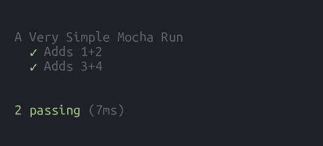

# Shell to PNG
Tools exist to screenshot websites, but why aren't there tools to screenshot console contents?

Add sample usage to your README as part of your build system, keep a tutorial's command line examples updated, or easily create a bug report without as much copy/paste.

And yes, the tool is compatible with all shells and many image formats, despite it's misleading name.

[](https://travis-ci.org/CodeLenny/sh2png)

## Sample Output



This image was created by passing the result of calling [Mocha](https://mochajs.org/) into `sh2png.format`.

See [test-format-mocha-output.coffee](test/test-format-mocha-output.coffee) for the test that produced the output above.
See the [results](test/sample/) of testing sh2png for other examples.

## Installation

Install via [NPM](https://www.npmjs.com/).

Don't have NPM?  Grab [NodeJS](https://nodejs.org/en/download/) or [Node Version Manager](https://github.com/creationix/nvm).

```sh
npm install [--save-dev] sh2png
```

## Node.js Usage

### Formatting Strings

Got some text from the console?  Call `sh2png.format` to turn a string of console text into an image.  `format` returns a [Promise].

Don't want to use Promises?  Here's some standard NodeJS code.

```js
sh2png = require("sh2png");
exec = require("child_process").exec;
env = process.env;
env.force_color_prompt = "yes";

exec("mocha", {env: env}, function (err, stdout, stderr) {
  // handle error
  sh2png
    .format(stdout)
    .then(function (img) {
      img.write(__dirname + "mocha_output.png", function(err) {
        // handle error
      });
    })
    .catch(function (err) {
      // handle error
    });
});
```

Want to use [Promises][Promise]?  (Example in CoffeeScript)

```coffeescript
sh2png = require "sh2png"
{exec} = require "child-process-promise"
env = process.env
env.force_color_prompt = "yes"

exec "mocha", {env}
  .then ({stdout}) ->
    sh2png.format stdout
  .then (img) ->
    img.writeAsync "#{__dirname}/mocha_output.png"
  .then ->
    # image written
  .catch (err) ->
    console.log err
```

[Promise]: https://developer.mozilla.org/en-US/docs/Web/JavaScript/Reference/Global_Objects/Promise